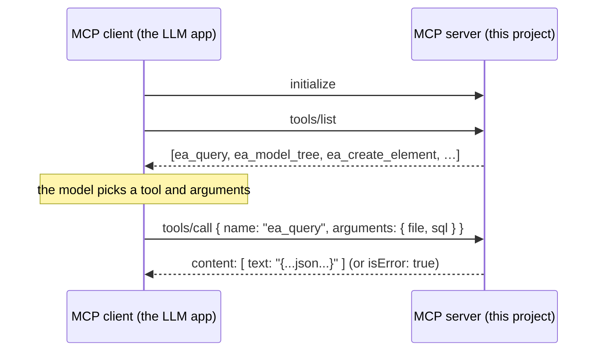

# Model Context Protocol

The **Model Context Protocol** (MCP) is an open protocol that lets an AI
application (an "MCP client", e.g. Claude Desktop) call **tools** and read
**resources** exposed by a separate process (an "MCP server"), over JSON-RPC.

## Why it exists

An LLM on its own cannot open files, run queries, or call APIs. MCP is a
standard way to give it those abilities without baking each integration into the
client: anyone can write a server, the client discovers its tools at runtime and
lets the model call them.

## How it works



- Transport is stdio (this server) or HTTP+SSE. Messages are JSON-RPC 2.0.
- A tool result is a list of content blocks (text, image, …). A **tool error**
  sets `isError: true` and puts the reason in the text — it is *not* a JSON-RPC
  error; the model sees it and can react.
- Each tool declares a JSON-Schema for its arguments, which the client shows the
  model.

## How it is structured in this project

`internal/mcpserver` builds one `server.MCPServer` (using
`github.com/mark3labs/mcp-go`) and registers 18 tools. `main.go` runs it with
`server.ServeStdio`. Each tool handler:

1. reads its arguments,
2. opens the target file through an injected opener (real implementation, or a
   fake in tests),
3. calls the connector / ArchiMate service,
4. returns the result as JSON text, or the error as a tool error.

## Example

Client config (Claude Desktop / Claude Code):

```json
{ "mcpServers": { "sparx-ea": { "command": "/path/to/mcp-server-sparx-ea" } } }
```

## Sources

- Model Context Protocol specification — <https://modelcontextprotocol.io>
- `github.com/mark3labs/mcp-go` v1.0.0 — the Go SDK this server uses.
