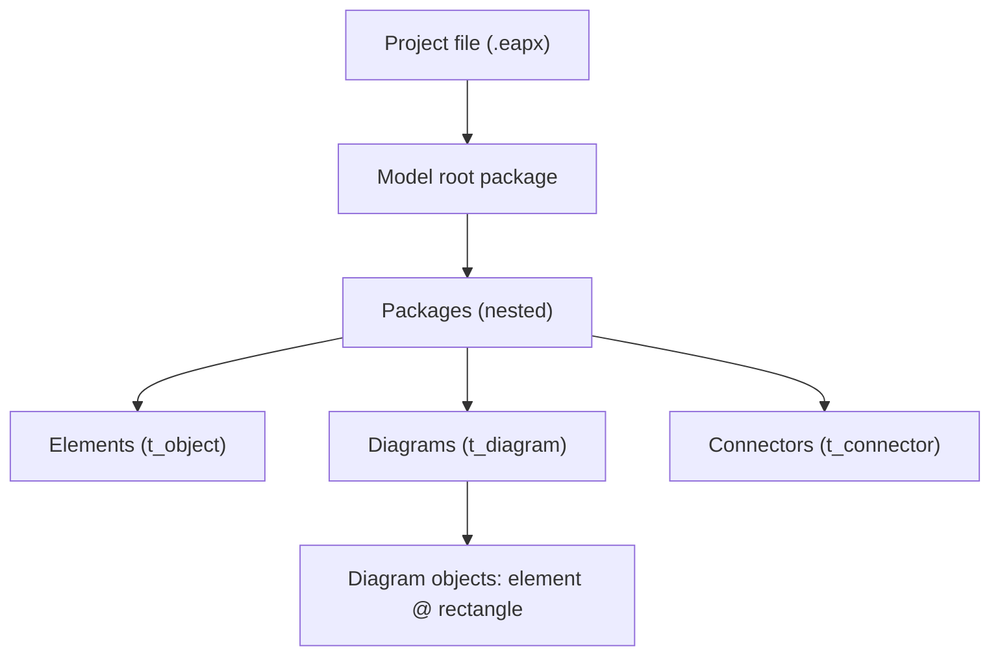

# Sparx Enterprise Architect

**Sparx Enterprise Architect** (EA) is a commercial modelling tool for UML,
ArchiMate, BPMN, SysML and related notations. A whole project — every element,
diagram, connector and their properties — lives in a single file.

## Why it exists

Architects and analysts need one place to keep a model that spans many diagrams
and notations, with cross-references (an element on five diagrams is one
element), versioning, and generation of documents and code. EA is one of the
long-established tools that does this.

## How it works

The project file is a database:

| Extension | Format |
| --- | --- |
| `.eap` | MS Access / JET 3.5 |
| `.eapx` | MS Access / JET 4 (Access 2000) |
| `.qea` / `.qeax` | SQLite (EA 16.0+) |
| `.feap` | Firebird |

EA reads and writes this database directly through its own engine. The tables
are prefixed `t_` — `t_object` (elements), `t_connector` (relationships),
`t_package`, `t_diagram`, `t_diagramobjects` (placements), and so on. GUIDs
(`{8-4-4-4-12}`) identify every object.

To move a model between projects EA offers **XMI** import/export
(`File → Export/Import → Package to/from XMI`). See [XMI](xmi.md).

## How it is structured

ArchiMate elements are stored as UML elements (`t_object.Object_Type = 'Class'`
or `'Activity'`) carrying a stereotype (`t_object.Stereotype = 'ArchiMate_Goal'`).
So an ArchiMate model is UML-with-stereotypes on disk.

## How this project uses it

- `ea_query` reads the `.eapx` database directly (via `mdbtools`), read-only.
- The ArchiMate tools work on an **XMI export** of the model, not the `.eapx` —
  EA 15.2's `.eapx` cannot be written safely from outside EA. See
  [the editing workflow](../workflow.md).

## Related concepts

- [XMI](xmi.md) — the export format the editing tools use.
- [ArchiMate](archimate.md) — the notation, and how EA stores it.

## Sources

- Sparx Systems, *Enterprise Architect User Guide* — <https://sparxsystems.com/enterprise_architect_user_guide/>
- File-format observations from `client/eapx/` (the `mdbtools` connector) and
  `client/eaxmi/` (the XMI codec) in this repository.
