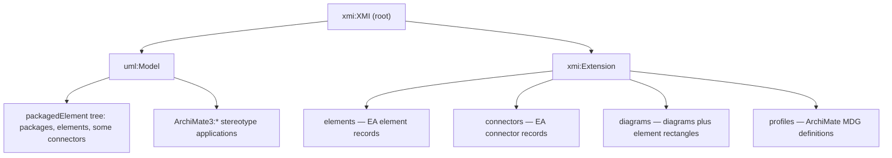

# XMI

**XMI** (XML Metadata Interchange) is an OMG standard for serialising a model
(UML, ArchiMate, …) as XML, so it can move between tools. Sparx EA reads and
writes an XMI 2.1 dialect via `File → Export/Import → Package to/from XMI`.

## Why it exists

Every modelling tool has its own storage format. XMI is the neutral wire format:
export from one tool, import into another. In this project it is also the only
practical way to *edit* a Sparx EA 15.2 model from outside EA — the `.eapx`
database cannot be written safely by anything but EA.

## How it works

EA's XMI export writes each model object **twice**:

1. In `<uml:Model>` — the semantic tree of `<packagedElement>` nodes (packages,
   classes, activities, associations, dependencies) plus `<edge>` and nested
   `<generalization>` for some relationship kinds.
2. In `<xmi:Extension extender="Enterprise Architect">` — EA-specific records:
   `<elements>/<element>`, `<connectors>/<connector>`, `<diagrams>/<diagram>`
   (with the element rectangles), and the ArchiMate stereotypes.

ArchiMate stereotypes appear as `<ArchiMate3:ArchiMate_Goal base_Class="EAID_…"/>`
elements — **direct children of `<uml:Model>`**, not of `<xmi:Extension>`.

Import matches by GUID: EA converts XMI ids (`EAID_A_B_C_D_E`) to braced GUIDs
(`{A-B-C-D-E}`), finds existing objects with the same GUID, and updates them in
place; anything new is created. EA shows the diff and asks to confirm.

## How it is structured



A package the export treats as the model root carries
`packageFlags="…isModel=1…"`. Only one package in a file may be a model root —
EA rejects a file with several.

## Example

`client/eaxmi/` is a pure-Go codec for this format:

```go
d, _ := eaxmi.Open("model.xml")          // parse both trees into structs
goal := d.ResolveElement("Model/Pkg/Goal1")
d.SetElementDocumentation(goal.XMIID, "revised")
d.WriteFile("edited.xml")                 // re-serialise
```

## Related concepts

- [Sparx Enterprise Architect](sparx-enterprise-architect.md) — the tool this
  XMI dialect belongs to.
- [The editing workflow](../workflow.md) — how the tools use export/import.

## Sources

- OMG, *MOF 2 XMI Mapping Specification* v2.5.1 — <https://www.omg.org/spec/XMI/>
- Format reverse-engineered from real EA exports; see `client/eaxmi/parse.go`,
  `client/eaxmi/write.go`, `client/eaxmi/new.go` in this repository.
